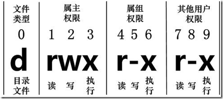

# Linux的文件属性



在 Linux 中`第一个字符`代表这个文件是目录、文件或链接文件等等。

```bash
当为 d 则是目录
当为 - 则是文件；
若是 l 则表示为链接文档(link file)；
若是 b 则表示为装置文件里面的可供储存的接口设备(可随机存取装置)；
若是 c 则表示为装置文件里面的串行端口设备，例如键盘、鼠标(一次性读取装置)
```

接下来的字符中，以三个为一组，且均为 `rwx`的三个参数的组合。其中， `r` 代表可读(read)、 `w` 代表可写(write)、 `x` 代表可执行(execute)。 要注意的是，这三个权限的位置不会改变，如果没有权限，就会出现减号 `-` 而已。

```bash
使用数字来代表各个权限
r：4
w：2
x：1
使用字母来代表三种身份的权限
属主：u（user）
数组：g（group）
其他：o（other）
+ ：为指定的用户类型增加权限
- ：去除指定用户类型的权限
= ：设置指定用户权限的设置，即将用户类型的所有权限重新设置
chmod u+x test 更改文件属性
chmod 777 test 更改文件属性，通过累加数字的方式
chown root.root test 更改文件属主/属组
```
